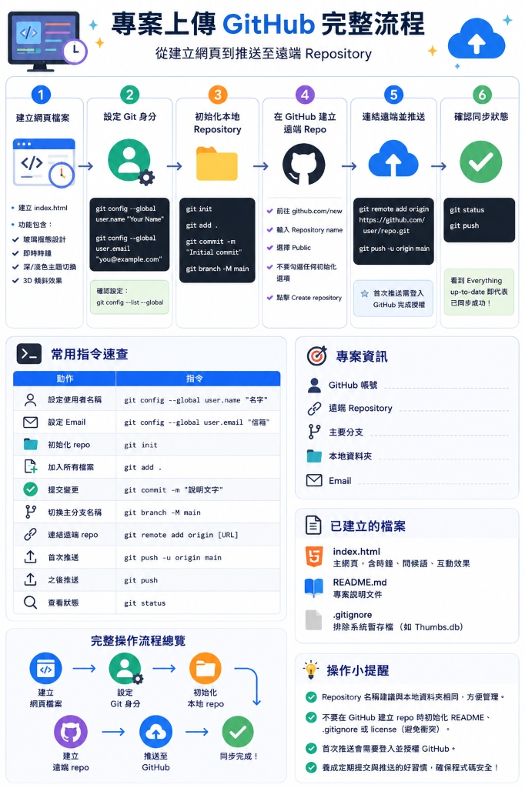

# 📋 專案上傳 GitHub 完整流程工作報告

- **專案名稱：** `wi` (Interactive Live Clock & Showcase)
- **報告日期：** 2026-05-29
- **報告人：** Winnie (winnieshih1107@gmail.com)

---

## 🗺️ 專案上傳 GitHub 完整流程圖

以下是本專案從建立網頁到推送到 GitHub 遠端 Repository 的完整操作步驟與指令流程圖：



---

## 🔍 流程步驟詳細說明

### 1. 建立網頁檔案
- **目標：** 建立網頁核心檔案 `index.html`。
- **包含功能：**
  - 玻璃帷幕設計 (Glassmorphism)
  - 即時時鐘 (Real-time Clock)
  - 深/淺色主題切換 (Dark/Light Toggle)
  - 3D 傾斜效果 (3D Interactive Tilt)

### 2. 設定 Git 身分
- **指令：**
  ```bash
  git config --global user.name "Winnie"
  git config --global user.email "winnieshih1107@gmail.com"
  ```
- **確認設定：** `git config --list --global`

### 3. 初始化本地 Repository
- **指令序列：**
  ```bash
  git init
  git add .
  git commit -m "Initial commit: Winnie dynamic clock page"
  git branch -M main
  ```

### 4. 在 GitHub 建立遠端 Repo
- 前往 **[github.com/new](https://github.com/new)**。
- 輸入與本地資料夾相同的專案名稱 **`wi`**。
- 選擇 **Public**。
- **重要：** 不要勾選任何初始化選項（如 README、.gitignore），避免與本地端產生衝突。
- 點擊 **Create repository**。

### 5. 連結遠端並推送
- 連結至您的 GitHub 遠端庫並推送：
  ```bash
  git remote add origin https://github.com/winnieshih1107/wi.git
  git push -u origin main
  ```
- *首次推送時，系統會開啟瀏覽器或彈出視窗要求登入 GitHub 進行授權。*

### 6. 確認同步狀態
- 日後修改檔案後，使用以下指令同步：
  ```bash
  git status
  git push
  ```
- 看到 `Everything up-to-date` 即代表同步成功！

---

## ⚡ 常用指令速查表

| 動作 | 指令 |
| :--- | :--- |
| **設定使用者名稱** | `git config --global user.name "名字"` |
| **設定 Email** | `git config --global user.email "信箱"` |
| **初始化 repo** | `git init` |
| **加入所有檔案** | `git add .` |
| **提交變更** | `git commit -m "說明文字"` |
| **切換主分支名稱** | `git branch -M main` |
| **連結遠端 repo** | `git remote add origin [URL]` |
| **首次推送** | `git push -u origin main` |
| **之後推送** | `git push` |
| **查看狀態** | `git status` |

---

## 📂 專案現有檔案清單

1. **[index.html](file:///D:/wi/index.html)** - 主網頁，含時鐘、問候語、互動效果。
2. **[README.md](file:///D:/wi/README.md)** - 專案說明文件，附帶 Live Demo 連結。
3. **[log.md](file:///D:/wi/log.md)** - 開發日誌紀錄。
4. **[工作報告.md](file:///D:/wi/工作報告.md)** - 本份工作流程報告。
5. **[github_flow.jpg](file:///D:/wi/github_flow.jpg)** - 流程圖圖檔。

---
*報告更新時間：2026-05-29*
